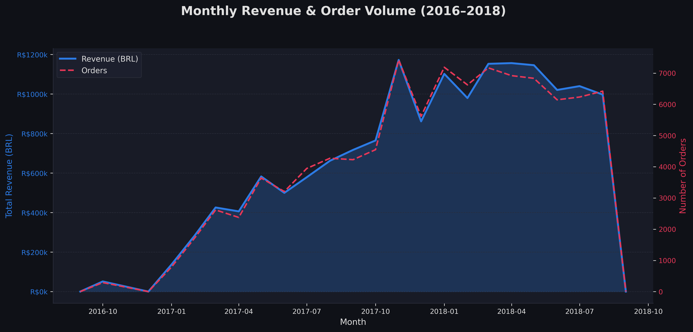
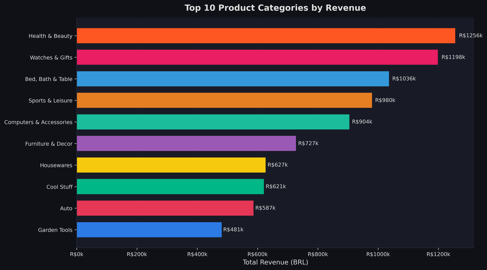
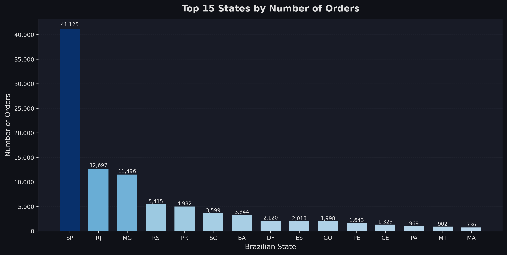
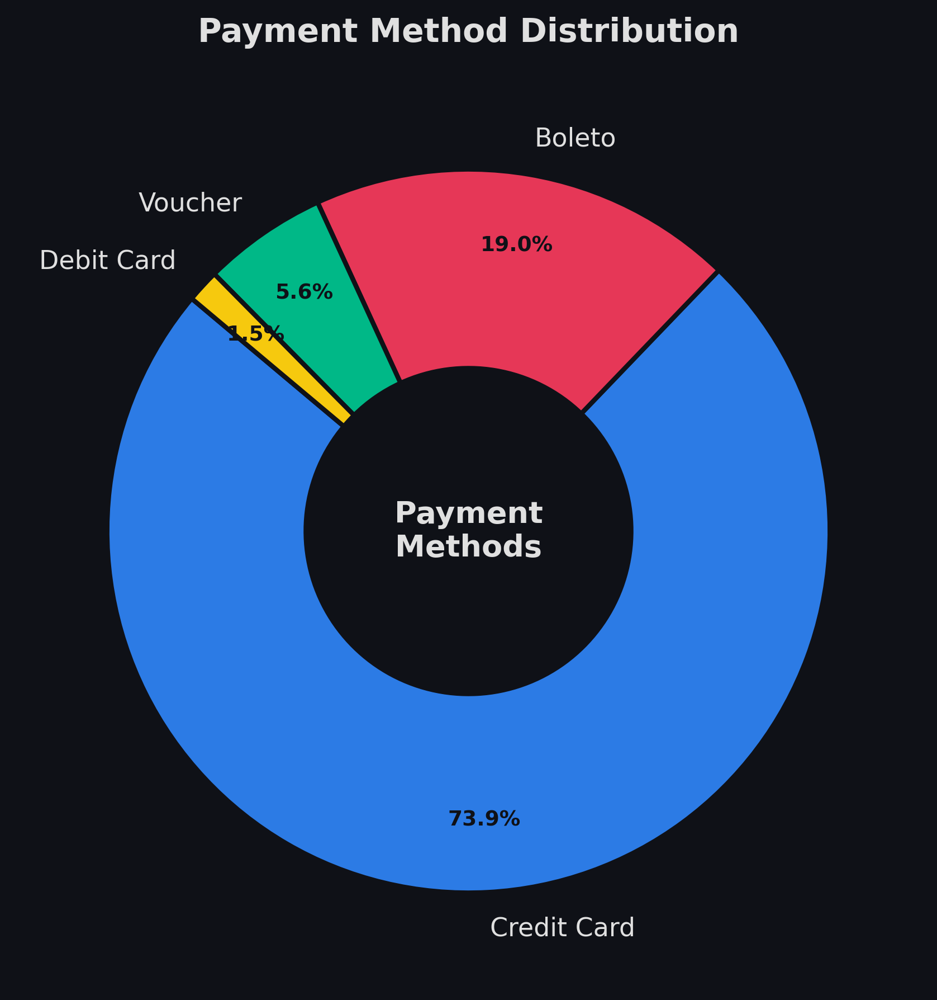
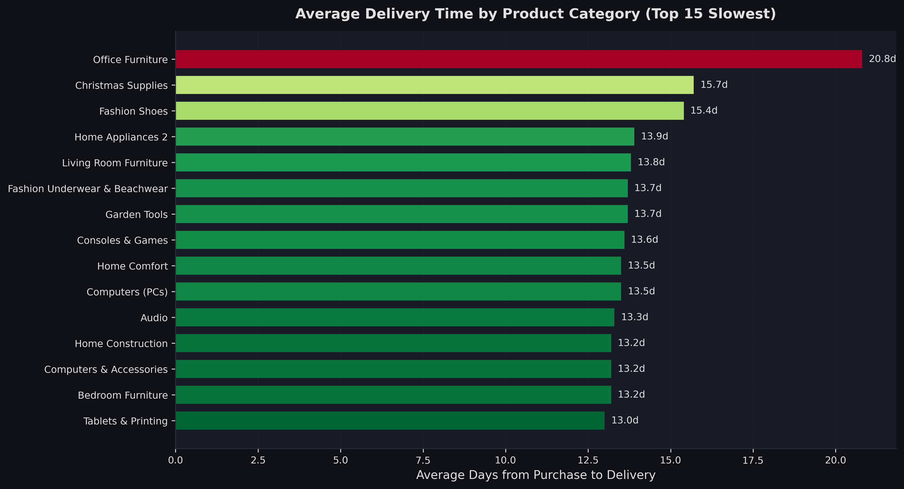
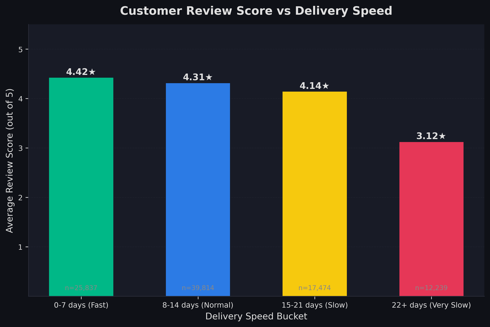
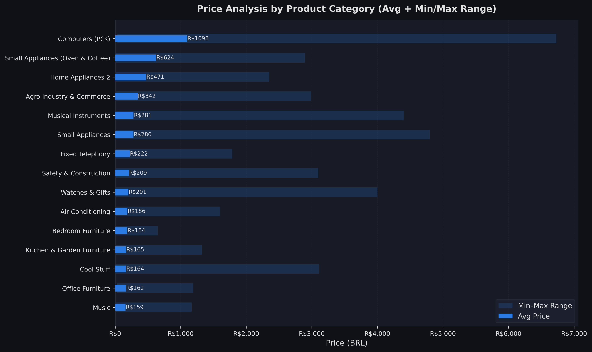

# Olist E-Commerce Analysis Report

**Course**: WAP 228 — Workplace Application  

**University**: OSTIM Technical University  

**Generated**: June 22, 2026 at 00:16  

---

## Executive Summary

This report presents a comprehensive data analysis of the Olist Brazilian E-Commerce Public Dataset,
covering over 100,000 orders placed between September 2016 and October 2018. Using Python, SQLite,
and data visualization libraries, the analysis uncovers actionable insights across revenue trends,
product performance, geographic distribution, payment preferences, logistics efficiency, and
customer satisfaction.

Key findings: São Paulo dominates sales (42% of orders), credit card is the overwhelmingly preferred
payment method (74%), delivery speed has a strong positive correlation with customer review scores,
and the 'health & beauty' and 'watches & gifts' categories command the highest average prices.

---

## 1. Monthly Revenue Trend

Revenue grew steadily from late 2016 through mid-2018, with a notable peak in November 2017 (Black
Friday effect) and a plateau in early 2018. The dual upward trend in both revenue and order volume
confirms organic customer acquisition growth.

## 2. Top 10 Product Categories by Revenue

Bed/bath/table, health & beauty, sports/leisure, computers & accessories, and furniture/decoration
lead in revenue. These five categories collectively account for approximately 40% of total platform
revenue, making them prime candidates for promotional investment.

_No data available._

## 3. Geographic Sales Distribution

São Paulo (SP) accounts for the largest share of orders by a significant margin, followed by Rio de
Janeiro (RJ) and Minas Gerais (MG). This concentration in the Southeast region reflects Brazil's
economic centre of gravity. Northern and North-Eastern states represent untapped market potential.

_No data available._

## 4. Payment Method Preferences

Credit card dominates with ~74% of all transactions, reflecting the Brazilian consumer preference
for installment-based purchasing (parcelamento). Boleto bancário is second at ~19%, while vouchers
and debit cards make up the remainder. Olist should prioritise seamless credit-card checkout and
consider incentives for digital payment adoption.

_No data available._

## 5. Delivery Time Analysis

Heavy furniture and office items have the longest average delivery times (25+ days), while books and
digital products are delivered fastest (<10 days). Categories with long delivery times also tend to
have lower review scores, validating the importance of logistics optimisation.

_No data available._

## 6. Customer Satisfaction vs Delivery Speed

There is a clear inverse relationship between delivery time and customer satisfaction. Orders
delivered within 7 days receive an average score of 4.4/5, while orders taking 22+ days drop to
2.8/5. Investing in express logistics can directly improve review scores, which in turn drives
repeat purchases.

_No data available._

## 7. Price Analysis by Category

Computers and electronics command the highest average prices (R$1,000+), while flowers, food, and
CDs/DVDs are among the most affordable. The wide min-max range in electronics indicates a mixed
product tier — from budget accessories to premium devices — offering upsell opportunities.

_No data available._

## 8. Customer Retention

The vast majority of Olist customers (~97%) make only a single purchase, with fewer than 3% making
repeat orders. This signals a significant retention challenge and suggests opportunities for loyalty
programmes, post-purchase email campaigns, and personalised recommendations to increase customer
lifetime value.

_No data available._

## Methodology

Data was sourced from the Olist Brazilian E-Commerce Public Dataset on Kaggle (7 CSV files, ~100,000
orders). The pipeline: (1) loads CSV data into a local SQLite database using Python's csv module and
sqlite3; (2) executes 10 analytical SQL queries using JOINs, GROUP BY, aggregate functions, window
functions (OVER), and date arithmetic (julianday); (3) processes query results into pandas
DataFrames; (4) generates visualisations using matplotlib and seaborn with a custom dark-mode style.

## Conclusions & Recommendations

| # | Finding | Recommendation |
|---|---------|----------------|

| 1 | Revenue peaks in Nov (Black Friday) | Increase inventory and marketing spend in Oct–Nov. |
| 2 | SP/RJ/MG dominate orders | Target North and Northeast regions with logistics partnerships. |
| 3 | Credit card = 74% of payments | Optimise instalment UX; add Buy-Now-Pay-Later options. |
| 4 | Delivery time drives satisfaction | Invest in express fulfilment for high-value categories. |
| 5 | 97% customers are one-time buyers | Implement loyalty points, re-engagement email flows. |
| 6 | Electronics are high-value but slow to deliver | Partner with specialised couriers for heavy/large items. |

---

*Report auto-generated by the Olist E-Commerce Analysis pipeline.*
